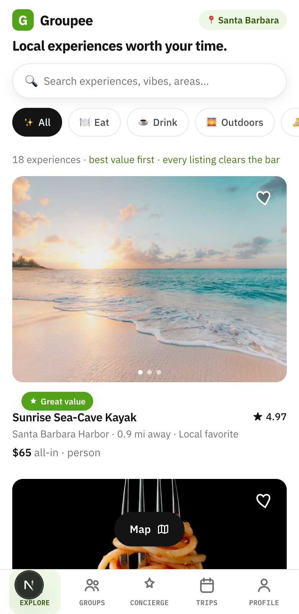
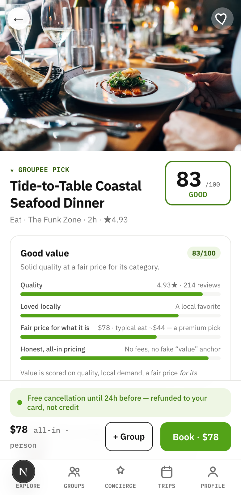
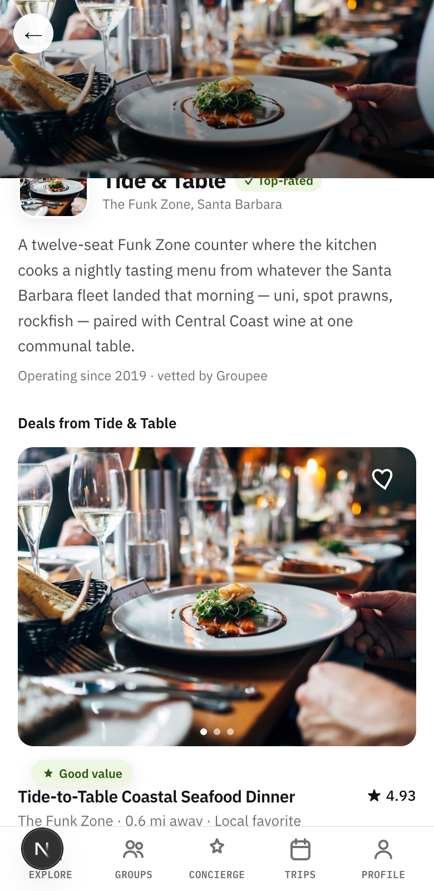
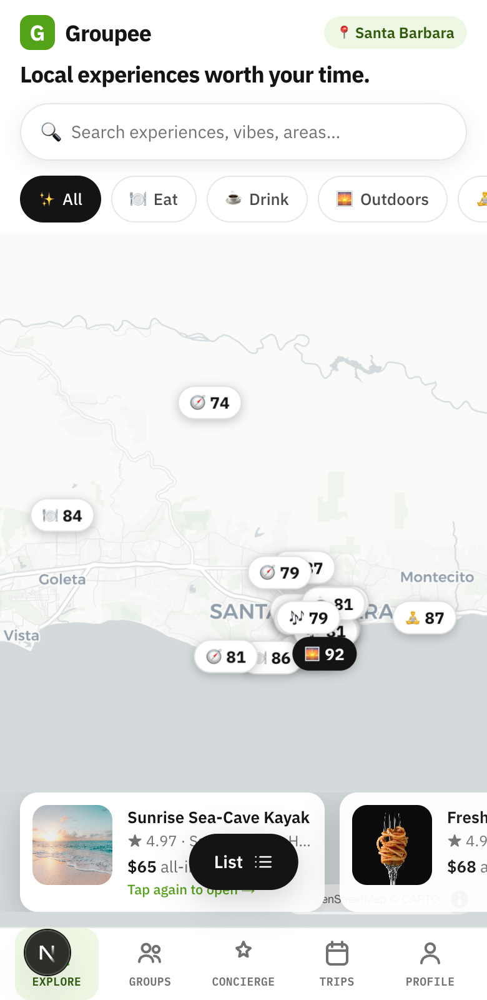
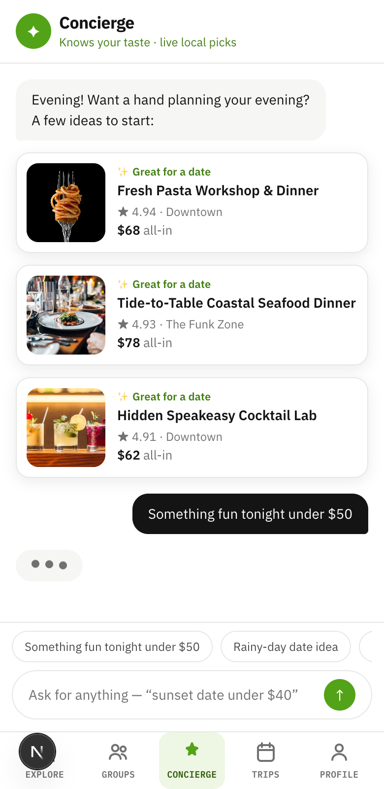
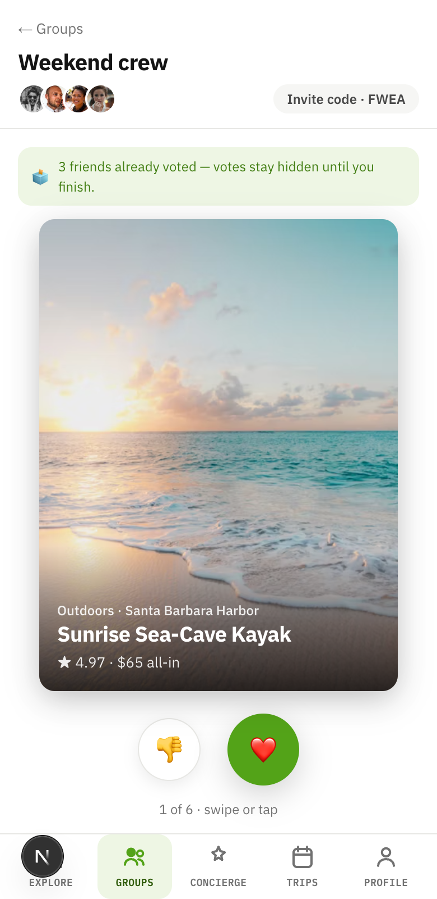
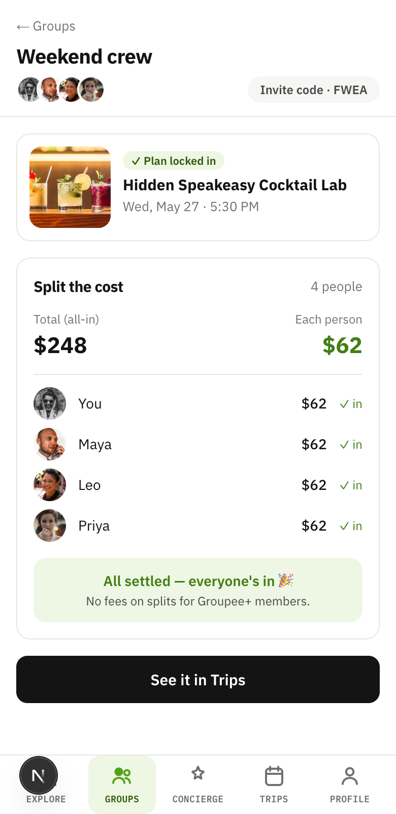
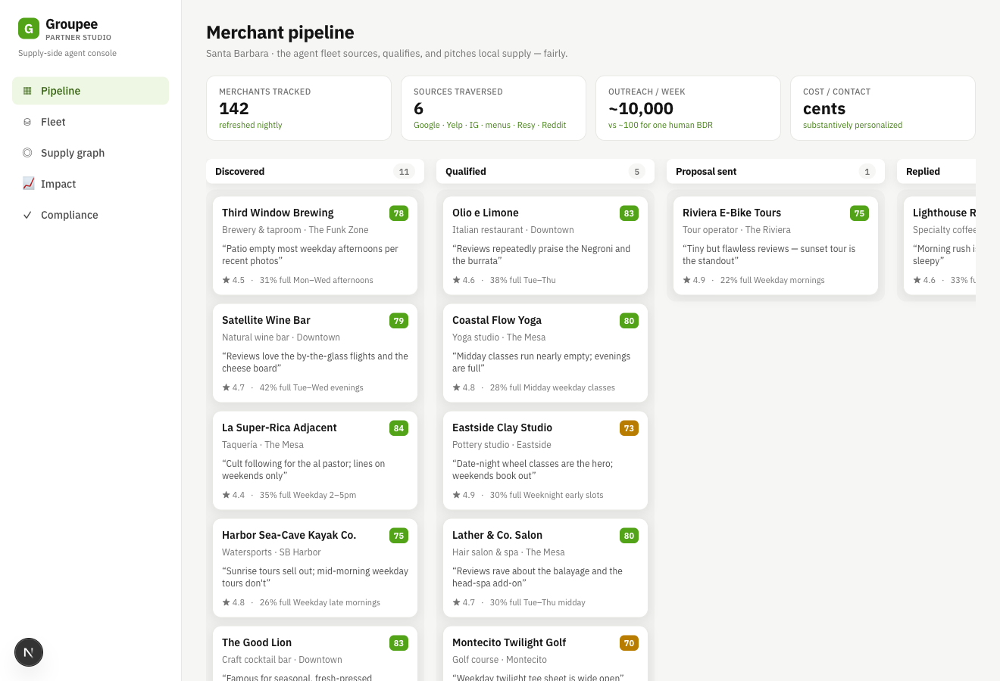
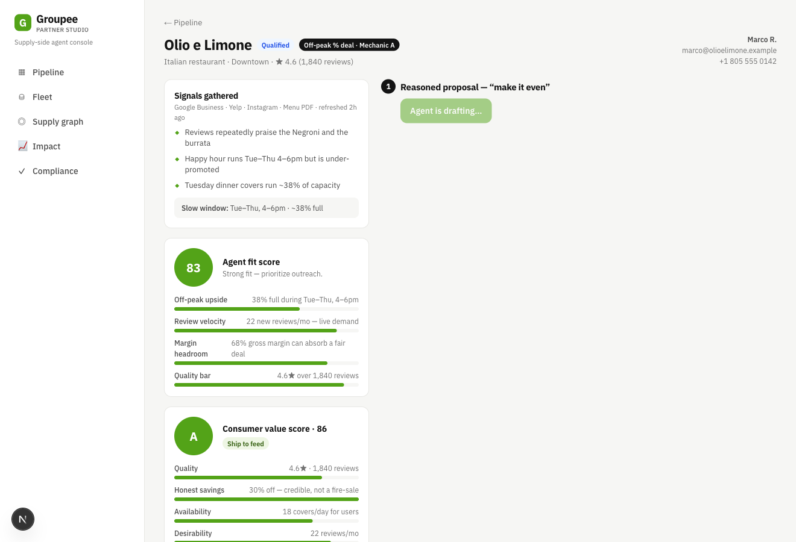
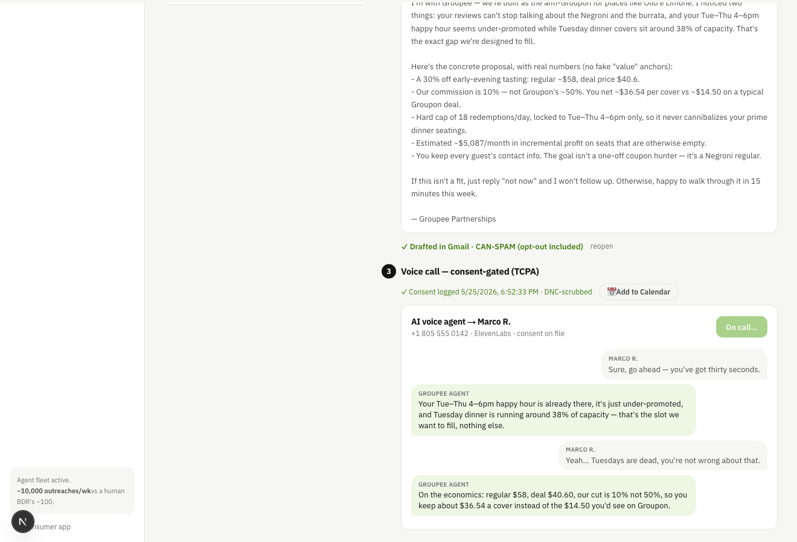

# Groupee 🌿

**A value-curated marketplace for local experiences — a reinvention of Groupon.** Browse genuinely good things to do nearby, plan them with friends, and book in a tap. No coupon dump: every listing clears a value bar, and prices are honest and all-in.

Three things make it different:
1. **Curated value, not discounts** — a StubHub-style **value score** gates the feed; you see "Great value," never a fake "$2,392 value" anchor.
2. **Social by default** — invite friends, swipe to vote, auto-commit the winner, split the cost; or ask the **AI concierge** "something fun tonight under $50."
3. **AI-sourced supply** — a merchant-side agent fleet finds local businesses and pitches them on *fair* terms, so the hard half of any marketplace (supply) actually scales. (See **Partner Studio**, below.)

> Beta prototype · Next.js 16 · React 19 · Tailwind v4 · MapLibre · live Claude + ElevenLabs (optional keys)

---

## Why

Groupon's decline is well documented (Wharton's *"Death of the Daily Deal"*, the Posies Cafe / TechCrunch merchant story, Rajiv Sethi & others on Substack). The root cause is consistent: **deep one-off discounting is self-terminating.** It attracts bargain-hunters who never return, compresses merchant margins below cost, trains your best customers to wait for coupons, damages merchant ratings, and rots into a "junk drawer of expiring coupons + spam email."

**Groupee inverts that thesis.** Imagery leads, price is quiet and honest (all-in, no fake "value" anchors), trust is built into the layout, and three differentiators sit on top of plain discovery:

1. **AI concierge** — "find me something tonight," context-aware (time of day), answering with visual cards and a *why you're seeing this* reason — not a wall of text.
2. **Groups** — invite friends, swipe to vote, the winner auto-commits to a shared plan, and costs split in-app.
3. **Maps** — a map with **value-score pins** (the score + a category icon, not a price) that re-filter as you switch categories, plus a synced card carousel.

No current app closes the full loop *concierge → group vote → committed plan → split cost*. That whitespace is the beta's reason to exist.

## Screens

| Explore — ranked by value | Experience detail | Business profile |
|---|---|---|
|  |  |  |

| Map — value-score pins | AI concierge | Groups — swipe to vote |
|---|---|---|
|  |  |  |

## Walkthrough — take the tour

Run it (below), then follow the click-path. Two loops to see: the **consumer** loop, and the **supply → consumer** loop that fills it.

**Consumer (`/`)**
1. **Explore** — the feed is **ranked by value**, not by ad spend. Every card carries a score seal; the top pick gets the magenta ring.
2. **Open a listing** — the **score + factor breakdown lead**, then the photos. Scroll to the **operator** card — it's a *business*, not a person; tap it.
3. **Business profile** — cover photo, authored bio, and **every deal that business runs on Groupee**.
4. **Map** (toggle from Explore) — pins show **score + a category icon**. Switch the category pill and the **map re-filters** with the feed.
5. **Concierge** — ask *"something fun tonight under $50"*; it answers with cards + a *why you're seeing this* reason (live Claude when a key is set).
6. **Groups** — start a plan, share the 4-letter code, **swipe to vote** (hidden until everyone's in), auto-commit the winner, then **split the cost** — fee-free for Groupee+ members.

| Groups — split the cost |
|---|
|  |

**Supply — Partner Studio (`/merchant`, desktop)**
7. **Pipeline** — the agent fleet sources local businesses and scores each on *merchant fit* **and** a *consumer value floor*; only deals ≥ 72 can publish.
8. **Open a prospect** — generate the **reasoned proposal** (live Claude, honest unit economics), **Approve & send** the email (CAN-SPAM gated), log consent, then the **consent-gated voice call** (audible ElevenLabs with a key).
9. **Onboard** — the prospect **publishes straight into the consumer feed** as a live, value-gated deal tagged **"New partner"**. That's the closed loop: the two halves are one system.

## Features

- **Explore** — search-first home, category pills, photo-first cards, list ⇄ map toggle.
- **Map** — MapLibre + CARTO Positron basemap; markers show the **value score + a category icon** (not a price) and **re-filter as you change category**; active-pin highlight + synced card carousel.
- **Experience detail** — **value-first**: a big score seal + the factor breakdown lead, *then* the photos (rating is demoted to a factor, not the headline); a sticky **Book · $X all-in** bar.
- **Business profiles** — the operator is a real **business**, not a host avatar. Tap it to open its profile — cover photo, an authored bio, and **every deal it runs on Groupee**.
- **Booking** — atomic date/time slot selection (no "paid but can't book"), color-coded refund policy shown *before* you reserve ("refunded to your card, not credit"), and one-tap support on the confirmation.
- **AI concierge** — context-aware proactive opener; parses intent + budget ("cheap + nightlife under $50"); replies as cards with reasoning. Backed by the live Claude API when an API key is present, with a deterministic local fallback otherwise.
- **Groups** — 4-letter invite code, Tinder-style voting (hidden until everyone's done), winner → one-tap committed plan, Splitwise-style split with vote-on-expense.
- **Trips** — time-ordered upcoming plans, solo and group.
- **Profile** — taste onboarding (seeds the feed + concierge), wishlists, **Groupee+** ($5/mo — 5% off every deal applied live at checkout, fee-free splits, early access; the non-discount monetization story), and per-category notification controls (the anti-spam answer).

## Anti-Groupon, by design

| Groupon pain point | Groupee's answer |
|---|---|
| Race-to-the-bottom discounts | Curated, quality-first experiences; honest all-in pricing |
| Bargain-hunters who never return | "Come back & save" loyalty nudge, not one-and-done |
| Refund entrapment (store credit, 3-day window) | Color-coded policy up front; refunds to your original card |
| Buried customer support | "Need help? — replies in ~2 min" on every confirmation |
| 235 spam emails a month | Per-category notification cadence (daily / weekly / off) |
| Inflated "$2,392 value" anchors | No fake anchors — just the real, all-in price |

## Supply side — Partner Studio (`/merchant`)

The harder half of any local marketplace is **supply density**, not consumer demand. Partner Studio is the merchant-acquisition console: an agent fleet that sources local businesses, qualifies them, and pitches them **fairly** — the opposite of Groupon's race-to-the-bottom. (Open `http://localhost:3000/merchant` — it's a full-width desktop tool, not the phone frame.)

| Pipeline | Reasoned proposal | Consent-gated voice call |
|---|---|---|
|  |  |  |

The workflow, end to end:

1. **Supply graph** — a nightly-refreshed map of every local merchant with a structured deal, assembled from Google Business, Yelp, Instagram/TikTok, menu PDFs, OpenTable/Resy, sites, and Reddit (simulated here).
2. **Qualification** — each prospect scored on off-peak upside, review velocity, margin headroom, and quality.
3. **Reasoned proposal ("make it even")** — generated **live by Claude**, leading with honest unit economics: a low ~10% commission (vs Groupon's ~50%), a hard redemption cap so it *fills* off-peak instead of cannibalizing peak, the merchant keeps every customer's contact for repeat visits, plus a "bring three friends, first round on the house" group offer. The math is computed in code (always correct); Claude writes the personalized narrative.
4. **Outreach email** — merchant-specific, behind a human **Approve & send** gate (CAN-SPAM: opt-out included).
5. **Voice call** — **consent-gated** (TCPA): the agent only dials after consent is logged, then delivers the pitch as an **audible ElevenLabs voice** (transcript-only without a key).
6. **Pipeline + CRM** — Attio-style board tracks each prospect Discovered → … → Onboarded.

**Vertical archetypes — the mechanic matches the inventory.** The agent doesn't ship one-size "30% off." Each category maps to one of three mechanics: **A** off-peak % fill (restaurants, social-entertainment, golf foursomes, tours), **B** access / value-add — *never* a public discount — for status inventory (nightclub tables, hotels), and **C** intro → regular for high-LTV services (beauty, fitness, recovery), where the win is the rebook, not the coupon. Economics adapt accordingly (discount vs. comped value-add vs. intro + lifetime value).

**Value Score — the StubHub move, away from coupons.** Every prospect gets two independent scores: a *merchant fit* score (worth acquiring?) and a *consumer Value Score* (is the deal actually good enough to show users?). A desperate, mediocre spot can pass merchant-fit but **fails the value floor** — so it never reaches the feed. Only deals scoring ≥ 72 are publishable; below that the agent must tune the offer or pass. On the consumer side this surfaces as a **"Great value" badge** on every listing — the feed is curated value, not a coupon dump.

**Closed loop + ops surfaces.** Onboarding a merchant in Partner Studio **publishes it as a live, value-gated deal in the consumer feed** (price from the deal economics, its archetype offer, a "New partner" tag) — the two halves are one system. Plus: a **Fleet** view that scores every prospect in parallel with a bulk "approve all Ship-grade" (the ~10k/wk-vs-100-BDR claim made tangible), an **Impact** dashboard with the board-letter KPIs (value-pass rate, verdict + mechanic mix, projected merchant profit), real **Gmail/Calendar deep-link outreach** from the workspace (prefilled, keyless), and live **Google Places discovery** on the supply graph (mock fallback without a key).

**Real stack this stands in for:** Google Places/Foursquare + Clay (sourcing/enrichment) → Attio (CRM; note CRM ≠ ERP) → Instantly/Smartlead (email, warmup + SPF/DKIM/DMARC) → ElevenLabs Agents + Twilio (voice, consent-gated). The in-app version simulates sourcing + CRM and uses the real Claude and ElevenLabs APIs.

## Tech stack

- **Next.js 16** (App Router) + **React 19** + **TypeScript**
- **Tailwind CSS v4** (CSS-based theming)
- **MapLibre GL** with CARTO Positron raster tiles (no API key required)
- **IBM Plex Sans + IBM Plex Mono** — the score-forward identity; mono carries every score, price, and rank numeral
- Client-side state via React context, persisted to `localStorage`
- Mobile-first, rendered inside a phone frame on desktop

## Run it

```bash
npm install
npm run dev
# open http://localhost:3000  (narrow the window or use device mode for the phone frame)
```

### Optional keys (everything works without them)

Copy `.env.example` to `.env.local` and fill in what you have:

```bash
cp .env.example .env.local
# ANTHROPIC_API_KEY  — live Claude for the consumer concierge AND merchant proposals/emails
# ELEVENLABS_API_KEY — makes the merchant voice-agent pitch audible at /merchant
```

With no keys, the concierge and merchant pitches fall back to a deterministic local engine and the voice call shows a transcript only — the app always runs.

## Project structure

```
app/
  page.tsx                 Explore (list + map)
  experience/[id]/         Experience detail + booking
  concierge/               AI concierge
  groups/  groups/[id]/    Group create → vote → commit → split
  trips/   profile/        Trips, taste onboarding, membership, settings
  merchant/                Supply-side Partner Studio (desktop): pipeline, supply graph,
                           compliance, and the per-prospect agent workspace ([id])
  api/concierge/           Claude API route — consumer concierge (optional key)
  api/merchant-pitch/      Claude API route — merchant proposal + email (optional key)
  api/voice/               ElevenLabs TTS proxy for the voice call (optional key)
components/                ExperienceCard, MapView, … + merchant/ (PipelineBoard, ScoreMeter,
                           EconomicsTable, EmailPreview, CallPanel, …)
lib/
  data.ts                  ~18 Santa Barbara experiences (mock, onboarded)
  concierge.ts             local concierge engine (Claude-swappable)
  store.tsx                wishlists, groups, votes, trips
  merchants.ts             ~12 prospect merchants — the simulated supply graph
  pitch.ts                 "make it even" economics engine + template fallback
  merchantStore.tsx        pipeline stage / consent / generated artifacts
```

---

*Beta — built as a design exploration. Mock marketplace data and no real payments or live dialing; the Claude (proposals/concierge) and ElevenLabs (voice) integrations are real when keys are provided.*
